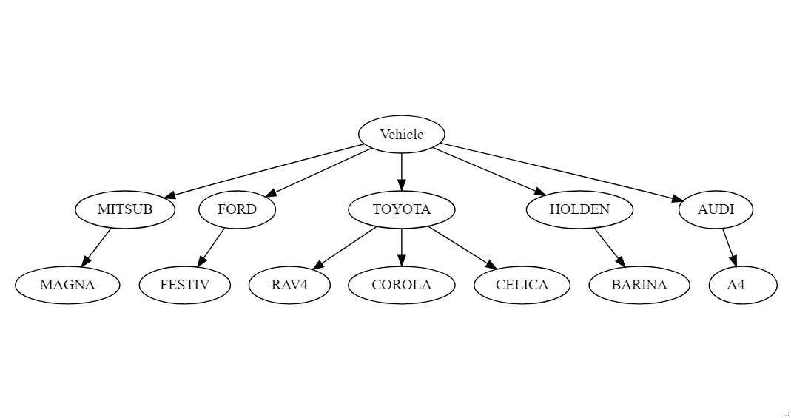
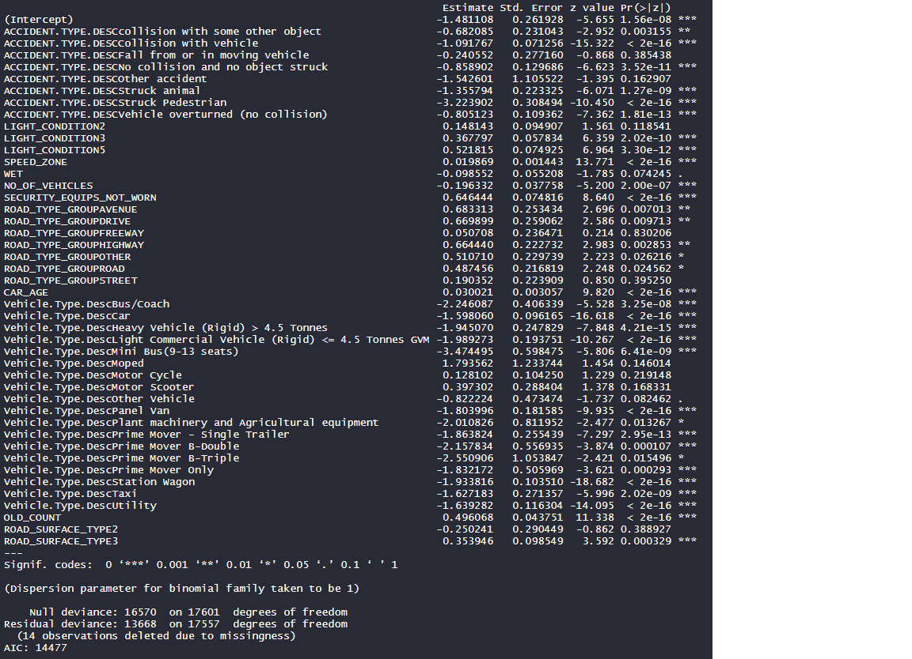

```{r setup, include=FALSE}
knitr::opts_chunk$set(echo = TRUE)
```

## Introduction

Road accidents may cause deaths and it may leave a lot of people seriously injured. In 2016, 5.34 road deaths occurred in Australia per 100,000 people (Bureau of Infrastructure, Transport and Regional Economics 2018). The number of vehicles registered each year in Australia is increasing with more than 1.5% per annum, inline with a similar increase in the population (Australian Bureau of Statistics 2019, Australian Bureau of Statistics 2018). There is thus an increasing call for road safety by the government, which can be noticed with the Towards Zero campaign setup by the Victorian government. The dataset that was analysed was collected also collected from a government website; from the Department of Planning, Transport and Infrastructure. 

This study dives deeper into the vehicle aspect of road accidents to answer the question of whether vehicle’s make and model have an impact on the severity of road accidents or not.


## Backgound, Research Quesion and Model Specification

The background for this assignment is informed by the initial research question “Which factors influence road fatalities in Victoria conditioned on there being an accident in the first place?”, and by the takeaway from our group assignment AT2. The previous study included a detailed exploratory data analysis (EDA) for the road accident data,, which was used to choose the independent variables, and a logistic regression on the dataset to find out what were the causes of high severity and fatalities in road accidents of Victorian Roads. 

The final result of the analysis as shown in Appendix 1 had concluded that type of accident, light condition, type of road and type of vehicle during the time of the accident had the most effect on the severity of road accidents. Low p (hence, statistically significant) values were observed on the vehicle’s part, such as the age of the vehicle and the type of vehicle (like buses, vans, taxis and cars). 

However, there may be an underlying effect within, where the make and the model of the vehicles would be causing an impact on the accidents’ severity. Such a structure is not considered by the previous model and without looking into more details, it cannot be assumed that Vehicle Type, in general, is significant. It is also worthwhile to find out how predictors on the different levels account in increasing or decreasing the severity of accidents. The group predictors (such as the age of the vehicle, damage done to a vehicle, its speed) can be conjugate with different hierarchies, and their effects can be analysed separately using a multilevel model. Therefore, I conduct my new analysis and reframe the research question as "Accounting for the hierarchical structure of the data, what are the effects of vehicles and other group predictors (vehicle age, damage, speed) on injured severity an fatalities?".

I also investigated different types of statistical modelling and finally chose a a simple multilevel model to factor the underlying variables. Using multilevel fixed effects model, inferences can be derived beyond a group. Using multilevel random effects model, the effect of both types of group level predictor variables and group level dummy variables can be estimated (Magnusson, 2015).

## Exploratory Data Analysis

### Structure of the dataset

The total dataset consists of 28 Vehicle types, from light such as bicycles to heavy ones. With the aim of making this study more specific, it will factor out two wheelers and heavy wheelers and will only take everyday vehicles from the small category of vehicles only, viz. car, station wagon, utility and taxi only.

```{r include=FALSE}
##################################################
## This script prepares the training and test
## datasets for both EDA and Modelling
##################################################
# Load Libraries
library(sqldf)
library(lme4)
library(tidyverse)
```

```{r include=FALSE}
# read data from source
accident <- read.csv("dataset/Road Crashes/ACCIDENT.csv")

vehicles <- read.csv("dataset/Road Crashes/VEHICLE.csv")

person <- read.csv("dataset/Road Crashes/PERSON.csv")
```

```{r include=FALSE}
# Temporary variable to store vehicle's types and descriptions
vehicle_type <- sqldf("select distinct VEHICLE_TYPE, \"Vehicle.Type.Desc\" from vehicles")
```

```{r include=FALSE}
# Join accident, vehicles and people datasets
avp_df1 <- sqldf("select a.ACCIDENT_NO, a.ACCIDENTDATE, a.SPEED_ZONE, v.VEHICLE_ID, v.VEHICLE_TYPE,
            v.VEHICLE_MAKE, v.VEHICLE_MODEL,
            v.\"Vehicle.Type.Desc\" as Vehicle_Type_Desc,
            v.VEHICLE_YEAR_MANUF, v.LEVEL_OF_DAMAGE,
            p.PERSON_ID,
            p.INJ_LEVEL, p.\"Inj.Level.Desc\" as Inj_Level_Desc
            from vehicles v
            inner join accident a on
            a.ACCIDENT_NO = v.ACCIDENT_NO
            inner join person p on
            p.ACCIDENT_NO = a.ACCIDENT_NO
            and p.VEHICLE_ID = v.VEHICLE_ID
            where v.VEHICLE_TYPE in (1, 2, 4)")
```

```{r include=FALSE}
# Join vehicle's model
vehicle_model <- sqldf("select VEHICLE_MAKE || VEHICLE_MODEL AS VEHICLE_MODEL, count(*) as my_Count
                      from vehicles where
                      VEHICLE_TYPE in (1, 2, 4) and VEHICLE_MODEL > 0
                      group by VEHICLE_MAKE || VEHICLE_MODEL
                      having my_Count >= 100")
```

```{r include=FALSE}
# Filter vehicles by model and remove unneeded ones
df <- sqldf("select ACCIDENT_NO, ACCIDENTDATE, VEHICLE_MAKE, VEHICLE_MODEL, 
            Vehicle_Type_Desc, min(INJ_LEVEL) as SEVERITY,
            VEHICLE_YEAR_MANUF, LEVEL_OF_DAMAGE, SPEED_ZONE
            from avp_df1
            where VEHICLE_MAKE || VEHICLE_MODEL IN (select VEHICLE_MODEL from vehicle_model)
            AND VEHICLE_MAKE NOT LIKE '%UNKN%'
            group by ACCIDENT_NO, ACCIDENTDATE, VEHICLE_MAKE, VEHICLE_MODEL, Vehicle_Type_Desc,
            VEHICLE_YEAR_MANUF, LEVEL_OF_DAMAGE")
```

```{r include=FALSE}
# Format date, years and number of years
df$ACCIDENTDATE <- as.Date(df$ACCIDENTDATE, "%d/%m/%Y")

df$ACCIDENT_YEAR <- as.numeric(format(df$ACCIDENTDATE, "%Y"))

df$NUM_OF_YEARS <- df$ACCIDENT_YEAR - df$VEHICLE_YEAR_MANUF
```

```{r include=FALSE}
# Create a training dataset
train <- df
```

```{r include=FALSE}
# Fix the categorical dependent variable- Severity- Yes and No
# If Severety is 1 or 2, put "Yes" else "No"
train$SEVERITY[train$SEVERITY == "2"] <- "1"
train$SEVERITY[train$SEVERITY == "3"] <- "2"
train$SEVERITY[train$SEVERITY == "4"] <- "2"

train$SEVERITY[train$SEVERITY == "1"] <- "0"
train$SEVERITY[train$SEVERITY == "2"] <- "1"

train$SEVERE[train$SEVERITY == "0"] <- "Yes"
train$SEVERE[train$SEVERITY == "1"] <- "No"


# Fix vehicle's make typos
train$VEHICLE_MAKE <- as.character(train$VEHICLE_MAKE)

train$VEHICLE_MAKE[train$VEHICLE_MAKE == "AUD   "] <- "AUDI"
train$VEHICLE_MAKE[train$VEHICLE_MAKE == "AUDI  "] <- "AUDI"

train$VEHICLE_MAKE[train$VEHICLE_MAKE == "B.M.  "] <- "B M W "
train$VEHICLE_MAKE[train$VEHICLE_MAKE == "L RO  "] <- "L ROV "

train$VEHICLE_MAKE[train$VEHICLE_MAKE == "FOR   "] <- "FORD"
train$VEHICLE_MAKE[train$VEHICLE_MAKE == "FOR"] <- "FORD"
train$VEHICLE_MAKE[train$VEHICLE_MAKE == "FORD  "] <- "FORD"

train$VEHICLE_MAKE[train$VEHICLE_MAKE == "LANDRO"] <- "LAND R"

train$VEHICLE_MAKE[train$VEHICLE_MAKE == "ROVER "] <- "ROVER"

train$VEHICLE_MAKE[train$VEHICLE_MAKE == "L ROV "] <- "LAND R"
train$VEHICLE_MAKE[train$VEHICLE_MAKE == "NIS   "] <- "NISSAN"
train$VEHICLE_MAKE[train$VEHICLE_MAKE == "SUB   "] <- "SUBARU"

train$VEHICLE_MAKE[train$VEHICLE_MAKE == "HYND  "] <- "HYUNDAI"
train$VEHICLE_MAKE[train$VEHICLE_MAKE == "HYNDAI"] <- "HYUNDAI"
train$VEHICLE_MAKE[train$VEHICLE_MAKE == "HYU   "] <- "HYUNDAI"
train$VEHICLE_MAKE[train$VEHICLE_MAKE == "HYUNDA"] <- "HYUNDAI"
train$VEHICLE_MAKE[train$VEHICLE_MAKE == "HYUNDI"] <- "HYUNDAI"

train$VEHICLE_MAKE[train$VEHICLE_MAKE == "MISTUB"] <- "MITSUB"

train$VEHICLE_MAKE[train$VEHICLE_MAKE == "R ROV "] <- "ROVER"

train$VEHICLE_MAKE[train$VEHICLE_MAKE == "VLK   "] <- "VOLKSW"
train$VEHICLE_MAKE[train$VEHICLE_MAKE == "VOLKS "] <- "VOLKSW"

train$VEHICLE_MAKE <- as.factor(train$VEHICLE_MAKE)

# Fix vehicle's Model typos
train$VEHICLE_MODEL <- as.character(train$VEHICLE_MODEL)

names(train$VEHICLE_MODEL) <- gsub("\\s+", "", names(train$VEHICLE_MODEL))

train$VEHICLE_MODEL[train$VEHICLE_MODEL == "LANDCR"] <- "LANCER"

train$VEHICLE_MODEL[train$VEHICLE_MODEL == "COROLL"] <- "COROLA"

train$VEHICLE_MODEL[train$VEHICLE_MODEL == "C/DORE"] <- "C'DORE"
train$VEHICLE_MODEL[train$VEHICLE_MODEL == "COMMO "] <- "COMM"
train$VEHICLE_MODEL[train$VEHICLE_MODEL == "COMM  "] <- "COMM"
train$VEHICLE_MODEL[train$VEHICLE_MODEL == "COMMOD"] <- "COMM"
train$VEHICLE_MODEL[train$VEHICLE_MODEL == "EXEC  "] <- "EXECUT"
train$VEHICLE_MODEL[train$VEHICLE_MODEL == "ELANTR"] <- "ELNTRA"
train$VEHICLE_MODEL[train$VEHICLE_MODEL == "LANTRA"] <- "ELNTRA"

train$VEHICLE_MODEL[train$VEHICLE_MODEL == "CR-V  "] <- "CRV"
train$VEHICLE_MODEL[train$VEHICLE_MODEL == "CRV   "] <- "CRV"

train$VEHICLE_MODEL[train$VEHICLE_MODEL == "FALCO "] <- "FALCON"
train$VEHICLE_MODEL[train$VEHICLE_MODEL == "MAZDA3"] <- "3"
train$VEHICLE_MODEL[train$VEHICLE_MODEL == "3     "] <- "3"
train$VEHICLE_MODEL[train$VEHICLE_MODEL == "RAV4  "] <- "RAV4 "
train$VEHICLE_MODEL[train$VEHICLE_MODEL == "RAV 4 "] <- "RAV4 "
train$VEHICLE_MODEL[train$VEHICLE_MODEL == "SANTA "] <- "SANTAF"
train$VEHICLE_MODEL[train$VEHICLE_MODEL == "SKYLNE  	"] <- "SKYLIN"
train$VEHICLE_MODEL[train$VEHICLE_MODEL == "SPORTA"] <- "SPTAGE"
train$VEHICLE_MODEL[train$VEHICLE_MODEL == "SKYLNE"] <- "SKYLIN"
train$VEHICLE_MODEL[train$VEHICLE_MODEL == "SKYLNE"] <- "SKYLIN"
train$VEHICLE_MODEL[train$VEHICLE_MODEL == "CX-5  "] <- "CX5   "

train$VEHICLE_MODEL <- as.factor(train$VEHICLE_MODEL)

# Change type of variable of Number of years from factor to numeric
train$NUM_OF_YEARS <- as.numeric(train$NUM_OF_YEARS)

# Put NAs for not needed values, i.e. have years of vehicle from 0 to 30 years
train$NUM_OF_YEARS[train$NUM_OF_YEARS < 0 ] <- NA
train$NUM_OF_YEARS[train$NUM_OF_YEARS > 30 ] <- NA

train$LEVEL_OF_DAMAGE <- as.factor(train$LEVEL_OF_DAMAGE)
train$LEVEL_OF_DAMAGE [train$LEVEL_OF_DAMAGE == '9']<- NA

# set Severe's type as factor
train$SEVERE <- factor(train$SEVERE,
                       levels=c("No", "Yes"),
                       labels=c("No", "Yes"))

# Once again,
# Change type of variable of Number of years from factor to numeric
train$NUM_OF_YEARS <- as.numeric(train$NUM_OF_YEARS)

# If speeds are greater than 100 or less than 0 then put NA
train$SPEED_ZONE[train$SPEED_ZONE >110 ] <- NA
train$NUM_OF_YEARS[train$NUM_OF_YEARS <0  ] <- NA
```

```{r include=FALSE}
##################################################
## This script is used to do EDA on the data
##################################################

# Load Libraries
library(ggplot2)
library(GGally)
library(reshape2)
library(lme4)
library(compiler)
library(parallel)
library(boot)
library(lattice)
library(sqldf)
library(data.tree)
library(DiagrammeR)
```

```{r include=FALSE}
# Get the list of vehicle's models
# create variables to be used
vehicle_models <- sqldf("select distinct VEHICLE_MAKE, VEHICLE_MODEL from train limit 7")

vehicle_models$pathString <- paste("Vehicle", 
                       vehicle_models$VEHICLE_MAKE, 
                       vehicle_models$VEHICLE_MODEL, 
                       sep = "/")
vehicle_models_copy <- as.Node(vehicle_models)
```


```{r include=FALSE}
# Join vehicle, accident and person data
vehicle_models <- sqldf("select a.ACCIDENT_NO, a.ACCIDENTDATE, a.SPEED_ZONE, v.VEHICLE_ID, v.VEHICLE_TYPE,
            v.VEHICLE_MAKE, v.VEHICLE_MODEL,
            substr(v.\"Vehicle.Type.Desc\", 0, 10) as Vehicle_Type_Desc,
            v.VEHICLE_YEAR_MANUF, v.LEVEL_OF_DAMAGE,
            p.PERSON_ID,
            p.INJ_LEVEL, p.\"Inj.Level.Desc\" as Inj_Level_Desc
            from vehicles v
            inner join accident a on
            a.ACCIDENT_NO = v.ACCIDENT_NO
            inner join person p on
            p.ACCIDENT_NO = a.ACCIDENT_NO
            and p.VEHICLE_ID = v.VEHICLE_ID")
```

The total dataset consists of 28 Vehicle types, from light such as bicycles to heavy ones. With the aim of making this study more specific, it will factor out two wheelers and heavy wheelers and will only take everyday vehicles from the small category of vehicles only, viz. car, station wagon, utility and taxi only.

```{r echo=FALSE, message=FALSE, warning=FALSE}
# Plot a bar graph using the above dataset
ggplot(vehicle_models, aes(x=Vehicle_Type_Desc)) + geom_bar()+
  theme(axis.text.x = element_text(angle = 90))+
  xlab("Vehicle Type")+
  ylab("Count of Accidents")
```
<center>
**Figure 1.** A bar graph showing the count of individual vehicle types in the dataset
</center> 

The data-frame used in the analysis is as follows:

| **Column Name**    | **Description**                                                                                                                                                                                                |
|--------------------|----------------------------------------------------------------------------------------------------------------------------------------------------------------------------------------------------------------|
| ACCIDENT_NO        | The Unique ID of the accident                                                                                                                                                                                  |
| ACCIDENTDATE       | The date of the accident                                                                                                                                                                                       |
| VEHICLE_MAKE       | The Make of the vehicle                                                                                                                                                                                        |
| VEHICLE_MODEL      | The Model of the vehicle                                                                                                                                                                                       |
| Vehicle_Type_Desc  | Description of the Type of the Vehicle (Car, Station Wagon)                                                                                                                                                  |
| VEHICLE_YEAR_MANUF | The year of Manufacture of the Vehicle                                                                                                                                                                         |
| LEVEL_OF_DAMAGE    | Damage Level: 1-6, 1 includes severely damaged                                                                                                                                                               |
| SPEED_ZONE         | The speed zone of the road which the accident occurred (This is assumed to be the speed of vehicle during crash and is taken as continuous- as speed of the vehicle is not always equal to speed zones speed) |
| ACCIDENT_YEAR      | Year of the accident, derived from `ACCIDENTDATE` (continuous)                                                                                                                                                |
| NUM_OF_YEARS       | Age of Car, obtained from `ACCIDENT_YEAR` - `VEHICLE_YEAR_MANUF`                                                                                                                                                 |
| SEVERE             | Is the accident severe? Binary: Yes and No                                                                                                                                                                     |
Now, checking for collinearity between the continuous variables `NUM_OF_YEARS` and `SPEED_ZONE`, we see that there it is minimal. Hence, both of them can be used in our model.

```{r message=FALSE, warning=FALSE}
# plot using GGpairs
ggpairs(train[, c("NUM_OF_YEARS", "SPEED_ZONE")],
        cardinality_threshold = NULL)
```
<center>
**Figure 2.** Checking collinearity between continuous residual variables
</center>

Looking at the distribution of severity on continuous variables (Figure 3), Number of Years (i.e. the age of car) and Speed Zone, we find that there is not much impact of the age of car on the severity of accidents, whereas with regards to the speed zone, accidents are more severe at higher speed zone areas.

```{r echo=FALSE, message=FALSE, warning=FALSE}
tmp <- melt(train[, c("SEVERE", "Vehicle_Type_Desc", "NUM_OF_YEARS", "SPEED_ZONE")])
# Fourth plot
ggplot(tmp, aes(factor(SEVERE), y = value, fill=factor(SEVERE))) +
  geom_boxplot() +
  facet_wrap(~variable, scales="free_y")
```
<center>
**Figure 3.** A box plot showing the distribution of continuous variables
</center>

Second test is to check for the ratios of the response variable, `SEVERE`. From Figure 4, it can be seen that there are no zeros, and also some of the ratios are large which may be due to the dataset being from the year 2006 to 2018. We will need to be careful with this during modeling our data.

```{r echo=FALSE}
# check data and results
vehicle_models <- table(train$VEHICLE_MAKE, train$SEVERE)

vehicle_models_copy <- as.data.frame.matrix(vehicle_models) 

vehicle_models_copy <- cbind(vehicle_models_copy, rownames(vehicle_models))

vehicle_binary <- sqldf("select \"rownames(vehicle_models)\" as VEHICLE_MAKE, No, Yes, (100.0 * No )/(Yes+No) as No_Percentage,
        (100.0 * Yes )/(Yes+No) as Yes_Percentage
      from vehicle_models_copy")
knitr::kable(vehicle_binary)
```

<center>
**Figure 4.** A table showing the number and percentage of Response variable
</center>

Now, regarding the levels in the data, a vehicle’s make and Vehicle’s model is a sample of wider population of model and make respectively. Hence, they can be used as levels for multilevel analysis. It is useful to compare between higher level units; hence we will be comparing the vehicle’s makes.

The data has a 2-level nested structure hierarchy. The lowest level (Level 2) is vehicle’s model, and highest level (Level 1) is the vehicle’s make, as shown in Figure 6.




<center>
**Figure 5.** A plot and a relationship diagram showing 2-level hierarchy in the dataset
</center>

Thus, we will be taking the `VEHICLE_MAKE` and `VEHICLE_MODEL` as our two levels for multilevel modeling. There are no predictor variables for VEHICLE_MAKE in this dataset. For `VEHICLE_MODEL` level, will take `LEVEL_OF_DAMAGE`, `SPEED_ZONE` and `NUM_OF_YEARS` as predictor variables.

The response variable, `SEVERE` is binary, having values ‘No’ and ‘Yes’. Hence, from the nature of the data and the response variable, the type of regression that we will be using is a logistic multilevel regression to access whether the vehicle’s attributes play a significant impact on the severity of accidents or not.

## Multilevel Model Design and Interpretation

Multilevel model treats units of analysis as independent observations and helps in drawing conclusions about the effects in those observations individually. The motivation to take up multilevel modeling can be due to the wish to make amendments to previously made inferences, or an interest in group effects of a research, or even to estimate the group effects using the group level predictors together. Whatever the motivation might be, there are a series of steps that are performed while doing multilevel regression. We will be performing each of those steps, taking inferences and moving onto the next until the best combination of variables is found.

We will be using `glmer` function of `lme4` package in R to compute the multi-level models with the optimizer `bobyqa` and value of nAGQ as 0, for optimizing the speed of the modeling. To compare the models, we will use the function AIC which stands for ‘An Information Criterion’ with log likelihood of the model. Lower value of AIC means a better model.

Now, the first step of doing multilevel modeling is to create a null model, with no effects, just the intercepts. A null model can be taken as the base model for analysis, and it will help to determine whether controlling the factor is useful or not.

From the data, we have more ‘No’ and less ‘Yes’. The lower coded group is ‘No’ in this analysis.

```{r include=FALSE}
#load libraries
library(lme4)
```

```{r echo=FALSE}
#MLM Step 1- Fixed Effects

m1 <- glm(SEVERE ~ 1,
          family= binomial(link= "logit"),
          data= train)

summary(m1)
m1$aic
```

<center>
**Figure 6.** A null model with only the response variable SEVERE
</center>

After the null model, a random intercept model is made using `glmer` using random intercept of `VEHICLE_MAKE`. From this model, we can see that the intercept’s estimate has changed towards the ‘No’ category. The variance due to random effect `VEHICLE_MAKE` is very small, so it is not significant.

```{r echo=FALSE}
m2 <- glmer(SEVERE ~ 1 + (1 | VEHICLE_MAKE), 
            data = train,
            family = binomial(link= "logit"),
            control = glmerControl(optimizer = "bobyqa"),
            nAGQ = 0
)

summary(m2)
AIC(logLik(m2))
```

<center>
**Figure 7.** A random intercept model with VEHICLE_MAKE independent variable
</center>

Now, again adding a second random intercept VEHICLE_MODEL to the above model to note the changes in the variance of the intercept (Figure 9), we can see that the estimate again changes more towards ‘No’. The variance of `VEHICLE_MODEL` is a little more than that of `VEHICLE_MAKE`, hence it can be said that `VEHICLE_MODEL` plays a bigger role.


```{r echo=FALSE}
#MLM Step 2.1- Random intercept
m2.1 <- glmer(SEVERE ~ 1 + (1 | VEHICLE_MAKE) + (1 | VEHICLE_MODEL),
              data = train,
              family = binomial(link= "logit"),
              control = glmerControl(optimizer = "bobyqa"),
              nAGQ = 0
)

summary(m2.1)
AIC(logLik(m2.1))
```

<center>
**Figure 8.** A random intercept model with VEHICLE_MAKE independent variable
</center>

Adding fixed variables NUM_OF_YEARS and `SPEED_ZONE` to the model, we have slight change in the intercepts. The positive value of Estimate indicates that adding these variables has increases the chance of getting a ‘Yes’, though they are very small. This means that there is a slight increase in the chances of having a higher severity when the vehicle gets older, or when the vehicle is in the higher speed zone (essentially meaning that the vehicle is in higher speed). This is shown in Figure 9.

```{r echo=FALSE}
#MLM Step 3

#MLM Step 3- Random Intercept
m3 <- glmer(SEVERE ~ NUM_OF_YEARS + SPEED_ZONE + (1 | VEHICLE_MAKE) + (1 | VEHICLE_MODEL),
            data = train,
            family = binomial(link= "logit"),
            control = glmerControl(optimizer = "bobyqa"),
            nAGQ = 0
)
summary(m3)
AIC(logLik(m3))
```

<center>
**Figure 9.** A random intercept model with added Level 2 fixed variables
</center>


Now, the last thing to do is to add a random slope in the model. A subset of the dataset where the accident year is 2018 was sued to see the effect as the computation did not complete for the entire dataset. It can be seen that the `NUM_OF_YEARS` has had a little impact on the Variance of the Random Effects model, so it is also not that significant. Adding other intercept values also does not have considerable effect on the data. Hence, we will be excluding it from our analysis.

```{r echo=FALSE}
#MLM Step 4 Random Slope Random Intercept
m4 <- glmer(SEVERE ~ NUM_OF_YEARS + SPEED_ZONE + 
              (NUM_OF_YEARS | VEHICLE_MAKE) + (1 | VEHICLE_MODEL),
            data = subset(train, format(as.Date(ACCIDENTDATE),"%Y")==2018),
            family = binomial(link= "logit"),
            control = glmerControl(optimizer = "bobyqa"),
            nAGQ = 0
)

summary(m4)
```

<center>
**Figure 10.** A random slope random intercept model applied on a subset of dataset to analyse the effects
</center>

We will now be taking the AIC to compare between our models and finding out the best model among them. Figure 11 shows the AIC values for all the models discussed above. It shows that the model `m3`, which takes `NUM_OF_YEARS` and `SPEED_ZONE` as the fixed variables and the random intercepts of our multilevel variables `VEHICLE_MAKE` and `VEHICLE_MODEL` gives the most efficient model.

```{r echo=FALSE}
#Test for dispersion for the best model, which is m3
m1$aic
AIC(logLik(m2))
AIC(logLik(m2.1))
AIC(logLik(m3))
```

<center>
**Figure 11.** Performance of models, compared using AIC
</center>

Though we have compared our models and found that our model m3 is the best fitting model, it has variance of intercepts only 0.081 for `VEHICLE_MODEL` and 0.0617 for `VEHICLE_MAKE`. Since the model is a same slope and random intercept model, the parallel regression lines which are drawn are separated by a very small distance. This implies that the regression lines drawn by using our independent variables will be very close to each other, which means that there is no effect of either `VEHICLE_TYPE` or `VEHICLE_MODEL` on our response variable individually. So, the answer to whether the vehicle’s make or model impacts severity of accidents is negative.

## Conclusion

The original study conducted by the group found that type of vehicle played a significant role in the severity of accidents. It had given an impression that except two wheelers, all the vehicle types were statistically significant. However, this assumption is contradicted by analysing deeper and performing multilevel modeling by taking a subset and using the vehicle’s make and model. The reason that the previous study had given those to be statistically significant may be due to overfitting, since the data points were in the order of 180,000.

The main thing to take from this study is that the simple regression models, though would give a good approximation, may be incorrect. It is necessary to go deeper into details if one were to set a firm assumption on the model. Lastly, this study has come up with the conclusion that the vehicle’s attributes are not statistically significant when it comes to the severity of the accidents.

## Reflection 

In my short but intense experience with modelling, I have personally come to the conclusion that the temptation to rely on algorithms is immense. Combined with computing power it makes us believe we have an artificial intelligence crystal ball at our finger tips.

The multilevel method can adjust the model assumption to better fit data with a hierarchy structure. It provides a better model fit by allowing random effect on the location and DayType variable to adapt to the two-level nested structure of this fuel data set, compare to linear model as previously discussed in the model justification session.

This model helps to provide a better estimate of the influence of predictor variables toward the response variable as it considers the dependency between different variables.

## References

1. Taimur, U., Liping, F., & F. M. M., Luis. (2016). Injury severity analysis: comparison of multilevel logistic regression models and effects of collision data aggregation. Retrieved from https://link.springer.com/article/10.1007/s40534-016-0096-4
2. Gudmundur, F., & Fred, L. M. (2004). Differences in male and female injury severities in sportutility vehicle, minivan, pickup and passenger car accidents. Retrieved from https://www.sciencedirect.com/science/article/pii/S0001457502001355
3. Bureau of Infrastructure, Transport and Regional Economics 2018, International road safety comparisons 2016, BITRE, Canberra.
4. Magnusson, K. (2015). Training for multilevel modeling. Retrieved from http://www.bristol.ac.uk/cmm/learning/multilevel-models/samples.html
5. Taylor, J. J. (2011). Confusing Stats Terms Explained: Residual. Retrieved from http://www.statsmakemecry.com/smmctheblog/confusing-stats-terms-explainedresidual.html
6. Blissett, R. (2017). Multilevel Modeling in R. Retrieved from https://rpubs.com/rslbliss/r_mlm_ws
7. Dr. Buchanan, E. M. (2019). R - Binary Logistic Multilevel Models. Viewed from https://www.youtube.com/watch?v=6MexZiX-2W8
8. Jovanovic, M. (2015). R Playbook: Introduction to Multilevel/Hierarchical Models. Retrieved from https://complementarytraining.net/r-playbook-introduction-to-multilevelhierarchical-models/
9. Borowski, T. G. Chapter 16: Multilevel Modeling. Retrieved from https://ademos.people.uic.edu/Chapter16.html

## Appendix 


<center>
**Appendix 1:** The final model of our group’s study on Road Accidents
</center>