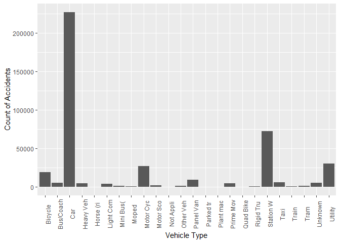
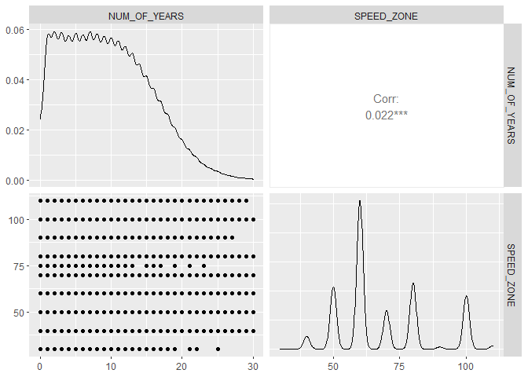
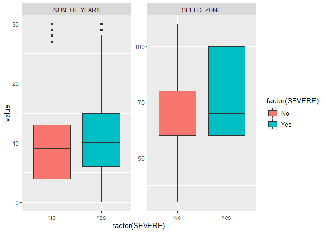

## Introduction

Road accidents may cause deaths and it may leave a lot of people
seriously injured. In 2016, 5.34 road deaths occurred in Australia per
100,000 people (Bureau of Infrastructure, Transport and Regional
Economics 2018). The number of vehicles registered each year in
Australia is increasing with more than 1.5% per annum, inline with a
similar increase in the population (Australian Bureau of Statistics
2019, Australian Bureau of Statistics 2018). There is thus an increasing
call for road safety by the government, which can be noticed with the
Towards Zero campaign setup by the Victorian government. The dataset
that was analysed was collected also collected from a government
website; from the Department of Planning, Transport and Infrastructure.

This study dives deeper into the vehicle aspect of road accidents to
answer the question of whether vehicle’s make and model have an impact
on the severity of road accidents or not.

## Backgound, Research Quesion and Model Specification

The background for this assignment is informed by the initial research
question “Which factors influence road fatalities in Victoria
conditioned on there being an accident in the first place?”, and by the
takeaway from our group assignment AT2. The previous study included a
detailed exploratory data analysis (EDA) for the road accident data,,
which was used to choose the independent variables, and a logistic
regression on the dataset to find out what were the causes of high
severity and fatalities in road accidents of Victorian Roads.

The final result of the analysis as shown in Appendix 1 had concluded
that type of accident, light condition, type of road and type of vehicle
during the time of the accident had the most effect on the severity of
road accidents. Low p (hence, statistically significant) values were
observed on the vehicle’s part, such as the age of the vehicle and the
type of vehicle (like buses, vans, taxis and cars).

However, there may be an underlying effect within, where the make and
the model of the vehicles would be causing an impact on the accidents’
severity. Such a structure is not considered by the previous model and
without looking into more details, it cannot be assumed that Vehicle
Type, in general, is significant. It is also worthwhile to find out how
predictors on the different levels account in increasing or decreasing
the severity of accidents. The group predictors (such as the age of the
vehicle, damage done to a vehicle, its speed) can be conjugate with
different hierarchies, and their effects can be analysed separately
using a multilevel model. Therefore, I conduct my new analysis and
reframe the research question as “Accounting for the hierarchical
structure of the data, what are the effects of vehicles and other group
predictors (vehicle age, damage, speed) on injured severity an
fatalities?”.

I also investigated different types of statistical modelling and finally
chose a a simple multilevel model to factor the underlying variables.
Using multilevel fixed effects model, inferences can be derived beyond a
group. Using multilevel random effects model, the effect of both types
of group level predictor variables and group level dummy variables can
be estimated (Magnusson, 2015).

## Exploratory Data Analysis

### Structure of the dataset

The total dataset consists of 28 Vehicle types, from light such as
bicycles to heavy ones. With the aim of making this study more specific,
it will factor out two wheelers and heavy wheelers and will only take
everyday vehicles from the small category of vehicles only, viz. car,
station wagon, utility and taxi only.

The total dataset consists of 28 Vehicle types, from light such as
bicycles to heavy ones. With the aim of making this study more specific,
it will factor out two wheelers and heavy wheelers and will only take
everyday vehicles from the small category of vehicles only, viz. car,
station wagon, utility and taxi only.


<center>
**Figure 1.** A bar graph showing the count of individual vehicle types
in the dataset
</center>

The data-frame used in the analysis is as follows:

| **Column Name**    | **Description**                                                                                                                                                                                               |
|--------------------|---------------------------------------------------------------------------------------------------------------------------------------------------------------------------------------------------------------|
| ACCIDENT_NO        | The Unique ID of the accident                                                                                                                                                                                 |
| ACCIDENTDATE       | The date of the accident                                                                                                                                                                                      |
| VEHICLE_MAKE       | The Make of the vehicle                                                                                                                                                                                       |
| VEHICLE_MODEL      | The Model of the vehicle                                                                                                                                                                                      |
| Vehicle_Type_Desc  | Description of the Type of the Vehicle (Car, Station Wagon)                                                                                                                                                   |
| VEHICLE_YEAR_MANUF | The year of Manufacture of the Vehicle                                                                                                                                                                        |
| LEVEL_OF_DAMAGE    | Damage Level: 1-6, 1 includes severely damaged                                                                                                                                                                |
| SPEED_ZONE         | The speed zone of the road which the accident occurred (This is assumed to be the speed of vehicle during crash and is taken as continuous- as speed of the vehicle is not always equal to speed zones speed) |
| ACCIDENT_YEAR      | Year of the accident, derived from `ACCIDENTDATE` (continuous)                                                                                                                                                |
| NUM_OF_YEARS       | Age of Car, obtained from `ACCIDENT_YEAR` - `VEHICLE_YEAR_MANUF`                                                                                                                                              |
| SEVERE             | Is the accident severe? Binary: Yes and No                                                                                                                                                                    |

Now, checking for collinearity between the continuous variables
`NUM_OF_YEARS` and `SPEED_ZONE`, we see that there it is minimal. Hence,
both of them can be used in our model.

``` r
# plot using GGpairs
ggpairs(train[, c("NUM_OF_YEARS", "SPEED_ZONE")],
        cardinality_threshold = NULL)
```


<center>
**Figure 2.** Checking collinearity between continuous residual
variables
</center>

Looking at the distribution of severity on continuous variables (Figure
3), Number of Years (i.e. the age of car) and Speed Zone, we find that
there is not much impact of the age of car on the severity of accidents,
whereas with regards to the speed zone, accidents are more severe at
higher speed zone areas.


<center>
**Figure 3.** A box plot showing the distribution of continuous
variables
</center>

Second test is to check for the ratios of the response variable,
`SEVERE`. From Figure 4, it can be seen that there are no zeros, and
also some of the ratios are large which may be due to the dataset being
from the year 2006 to 2018. We will need to be careful with this during
modeling our data.

| VEHICLE_MAKE |    No |  Yes | No_Percentage | Yes_Percentage |
|:-------------|------:|-----:|--------------:|---------------:|
| AUDI         |   885 |   84 |      91.33127 |       8.668731 |
| B M W        |  1523 |  183 |      89.27315 |      10.726846 |
| CHRYS        |   190 |   31 |      85.97285 |      14.027149 |
| DAEWOO       |   719 |  187 |      79.35982 |      20.640177 |
| DAIHAT       |   431 |  121 |      78.07971 |      21.920290 |
| FORD         | 26546 | 5439 |      82.99515 |      17.004846 |
| HOLDEN       | 33840 | 7299 |      82.25771 |      17.742288 |
| HONDA        |  8592 | 1370 |      86.24774 |      13.752259 |
| HYUNDAI      |  7562 | 1728 |      81.39935 |      18.600646 |
| ISUZU        |   118 |   10 |      92.18750 |       7.812500 |
| JEEP         |   819 |   91 |      90.00000 |      10.000000 |
| KIA          |  2429 |  413 |      85.46798 |      14.532020 |
| LAND R       |   371 |   71 |      83.93665 |      16.063348 |
| LEXUS        |   291 |   21 |      93.26923 |       6.730769 |
| M MOVE       |   202 |   36 |      84.87395 |      15.126050 |
| MAZDA        |  9812 | 1692 |      85.29207 |      14.707928 |
| MERC B       |   824 |  110 |      88.22270 |      11.777302 |
| MITSUB       | 11503 | 2502 |      82.13495 |      17.865048 |
| NISSAN       | 10451 | 1907 |      84.56870 |      15.431300 |
| PEUG         |   331 |   51 |      86.64921 |      13.350785 |
| REN          |   334 |   49 |      87.20627 |      12.793734 |
| SUBARU       |  4020 |  631 |      86.43303 |      13.566975 |
| SUZUKI       |  2041 |  440 |      82.26522 |      17.734784 |
| TOYOTA       | 32456 | 5840 |      84.75037 |      15.249634 |
| VOLKSW       |  3818 |  408 |      90.34548 |       9.654520 |
| VOLVO        |   230 |   15 |      93.87755 |       6.122449 |

<center>
**Figure 4.** A table showing the number and percentage of Response
variable
</center>

Now, regarding the levels in the data, a vehicle’s make and Vehicle’s
model is a sample of wider population of model and make respectively.
Hence, they can be used as levels for multilevel analysis. It is useful
to compare between higher level units; hence we will be comparing the
vehicle’s makes.

The data has a 2-level nested structure hierarchy. The lowest level
(Level 2) is vehicle’s model, and highest level (Level 1) is the
vehicle’s make, as shown in Figure 6.


<center>
**Figure 5.** A plot and a relationship diagram showing 2-level
hierarchy in the dataset
</center>

Thus, we will be taking the `VEHICLE_MAKE` and `VEHICLE_MODEL` as our
two levels for multilevel modeling. There are no predictor variables for
VEHICLE_MAKE in this dataset. For `VEHICLE_MODEL` level, will take
`LEVEL_OF_DAMAGE`, `SPEED_ZONE` and `NUM_OF_YEARS` as predictor
variables.

The response variable, `SEVERE` is binary, having values ‘No’ and ‘Yes’.
Hence, from the nature of the data and the response variable, the type
of regression that we will be using is a logistic multilevel regression
to access whether the vehicle’s attributes play a significant impact on
the severity of accidents or not.

## Multilevel Model Design and Interpretation

Multilevel model treats units of analysis as independent observations
and helps in drawing conclusions about the effects in those observations
individually. The motivation to take up multilevel modeling can be due
to the wish to make amendments to previously made inferences, or an
interest in group effects of a research, or even to estimate the group
effects using the group level predictors together. Whatever the
motivation might be, there are a series of steps that are performed
while doing multilevel regression. We will be performing each of those
steps, taking inferences and moving onto the next until the best
combination of variables is found.

We will be using `glmer` function of `lme4` package in R to compute the
multi-level models with the optimizer `bobyqa` and value of nAGQ as 0,
for optimizing the speed of the modeling. To compare the models, we will
use the function AIC which stands for ‘An Information Criterion’ with
log likelihood of the model. Lower value of AIC means a better model.

Now, the first step of doing multilevel modeling is to create a null
model, with no effects, just the intercepts. A null model can be taken
as the base model for analysis, and it will help to determine whether
controlling the factor is useful or not.

From the data, we have more ‘No’ and less ‘Yes’. The lower coded group
is ‘No’ in this analysis.

    ## 
    ## Call:
    ## glm(formula = SEVERE ~ 1, family = binomial(link = "logit"), 
    ##     data = train)
    ## 
    ## Deviance Residuals: 
    ##     Min       1Q   Median       3Q      Max  
    ## -0.5922  -0.5922  -0.5922  -0.5922   1.9118  
    ## 
    ## Coefficients:
    ##              Estimate Std. Error z value Pr(>|z|)    
    ## (Intercept) -1.652077   0.006227  -265.3   <2e-16 ***
    ## ---
    ## Signif. codes:  0 '***' 0.001 '**' 0.01 '*' 0.05 '.' 0.1 ' ' 1
    ## 
    ## (Dispersion parameter for binomial family taken to be 1)
    ## 
    ##     Null deviance: 168537  on 191066  degrees of freedom
    ## Residual deviance: 168537  on 191066  degrees of freedom
    ## AIC: 168539
    ## 
    ## Number of Fisher Scoring iterations: 3

    ## [1] 168538.8

<center>
**Figure 6.** A null model with only the response variable SEVERE
</center>

After the null model, a random intercept model is made using `glmer`
using random intercept of `VEHICLE_MAKE`. From this model, we can see
that the intercept’s estimate has changed towards the ‘No’ category. The
variance due to random effect `VEHICLE_MAKE` is very small, so it is not
significant.

    ## Generalized linear mixed model fit by maximum likelihood (Adaptive Gauss-Hermite Quadrature, nAGQ = 0) ['glmerMod']
    ##  Family: binomial  ( logit )
    ## Formula: SEVERE ~ 1 + (1 | VEHICLE_MAKE)
    ##    Data: train
    ## Control: glmerControl(optimizer = "bobyqa")
    ## 
    ##      AIC      BIC   logLik deviance df.resid 
    ## 167999.7 168020.0 -83997.8 167995.7   191065 
    ## 
    ## Scaled residuals: 
    ##     Min      1Q  Median      3Q     Max 
    ## -0.5155 -0.4643 -0.4241 -0.3993  3.3047 
    ## 
    ## Random effects:
    ##  Groups       Name        Variance Std.Dev.
    ##  VEHICLE_MAKE (Intercept) 0.09991  0.3161  
    ## Number of obs: 191067, groups:  VEHICLE_MAKE, 26
    ## 
    ## Fixed effects:
    ##             Estimate Std. Error z value Pr(>|z|)    
    ## (Intercept) -1.83607    0.06563  -27.98   <2e-16 ***
    ## ---
    ## Signif. codes:  0 '***' 0.001 '**' 0.01 '*' 0.05 '.' 0.1 ' ' 1

    ## [1] 167999.7

<center>
**Figure 7.** A random intercept model with VEHICLE_MAKE independent
variable
</center>

Now, again adding a second random intercept VEHICLE_MODEL to the above
model to note the changes in the variance of the intercept (Figure 9),
we can see that the estimate again changes more towards ‘No’. The
variance of `VEHICLE_MODEL` is a little more than that of
`VEHICLE_MAKE`, hence it can be said that `VEHICLE_MODEL` plays a bigger
role.

    ## Generalized linear mixed model fit by maximum likelihood (Adaptive Gauss-Hermite Quadrature, nAGQ = 0) ['glmerMod']
    ##  Family: binomial  ( logit )
    ## Formula: SEVERE ~ 1 + (1 | VEHICLE_MAKE) + (1 | VEHICLE_MODEL)
    ##    Data: train
    ## Control: glmerControl(optimizer = "bobyqa")
    ## 
    ##      AIC      BIC   logLik deviance df.resid 
    ## 166726.4 166756.9 -83360.2 166720.4   191064 
    ## 
    ## Scaled residuals: 
    ##     Min      1Q  Median      3Q     Max 
    ## -0.7033 -0.4723 -0.4267 -0.3472  3.8562 
    ## 
    ## Random effects:
    ##  Groups        Name        Variance Std.Dev.
    ##  VEHICLE_MODEL (Intercept) 0.13661  0.3696  
    ##  VEHICLE_MAKE  (Intercept) 0.06169  0.2484  
    ## Number of obs: 191067, groups:  VEHICLE_MODEL, 204; VEHICLE_MAKE, 26
    ## 
    ## Fixed effects:
    ##             Estimate Std. Error z value Pr(>|z|)    
    ## (Intercept) -1.86202    0.06242  -29.83   <2e-16 ***
    ## ---
    ## Signif. codes:  0 '***' 0.001 '**' 0.01 '*' 0.05 '.' 0.1 ' ' 1

    ## [1] 166726.4

<center>
**Figure 8.** A random intercept model with VEHICLE_MAKE independent
variable
</center>

Adding fixed variables NUM_OF_YEARS and `SPEED_ZONE` to the model, we
have slight change in the intercepts. The positive value of Estimate
indicates that adding these variables has increases the chance of
getting a ‘Yes’, though they are very small. This means that there is a
slight increase in the chances of having a higher severity when the
vehicle gets older, or when the vehicle is in the higher speed zone
(essentially meaning that the vehicle is in higher speed). This is shown
in Figure 9.

    ## Generalized linear mixed model fit by maximum likelihood (Adaptive Gauss-Hermite Quadrature, nAGQ = 0) ['glmerMod']
    ##  Family: binomial  ( logit )
    ## Formula: SEVERE ~ NUM_OF_YEARS + SPEED_ZONE + (1 | VEHICLE_MAKE) + (1 |      VEHICLE_MODEL)
    ##    Data: train
    ## Control: glmerControl(optimizer = "bobyqa")
    ## 
    ##      AIC      BIC   logLik deviance df.resid 
    ## 154658.2 154708.7 -77324.1 154648.2   181755 
    ## 
    ## Scaled residuals: 
    ##     Min      1Q  Median      3Q     Max 
    ## -1.1671 -0.4643 -0.3783 -0.2953  5.6321 
    ## 
    ## Random effects:
    ##  Groups        Name        Variance Std.Dev.
    ##  VEHICLE_MODEL (Intercept) 0.08175  0.2859  
    ##  VEHICLE_MAKE  (Intercept) 0.04432  0.2105  
    ## Number of obs: 181760, groups:  VEHICLE_MODEL, 204; VEHICLE_MAKE, 26
    ## 
    ## Fixed effects:
    ##                Estimate Std. Error z value Pr(>|z|)    
    ## (Intercept)  -3.9070221  0.0599406  -65.18   <2e-16 ***
    ## NUM_OF_YEARS  0.0337731  0.0012230   27.62   <2e-16 ***
    ## SPEED_ZONE    0.0257278  0.0003657   70.35   <2e-16 ***
    ## ---
    ## Signif. codes:  0 '***' 0.001 '**' 0.01 '*' 0.05 '.' 0.1 ' ' 1
    ## 
    ## Correlation of Fixed Effects:
    ##             (Intr) NUM_OF
    ## NUM_OF_YEAR -0.180       
    ## SPEED_ZONE  -0.441  0.008

    ## [1] 154658.2

<center>
**Figure 9.** A random intercept model with added Level 2 fixed
variables
</center>

Now, the last thing to do is to add a random slope in the model. A
subset of the dataset where the accident year is 2018 was sued to see
the effect as the computation did not complete for the entire dataset.
It can be seen that the `NUM_OF_YEARS` has had a little impact on the
Variance of the Random Effects model, so it is also not that
significant. Adding other intercept values also does not have
considerable effect on the data. Hence, we will be excluding it from our
analysis.

    ## Generalized linear mixed model fit by maximum likelihood (Adaptive Gauss-Hermite Quadrature, nAGQ = 0) ['glmerMod']
    ##  Family: binomial  ( logit )
    ## Formula: SEVERE ~ NUM_OF_YEARS + SPEED_ZONE + (NUM_OF_YEARS | VEHICLE_MAKE) +      (1 | VEHICLE_MODEL)
    ##    Data: subset(train, format(as.Date(ACCIDENTDATE), "%Y") == 2018)
    ## Control: glmerControl(optimizer = "bobyqa")
    ## 
    ##      AIC      BIC   logLik deviance df.resid 
    ##   8251.5   8302.9  -4118.7   8237.5    11453 
    ## 
    ## Scaled residuals: 
    ##     Min      1Q  Median      3Q     Max 
    ## -1.2290 -0.4023 -0.3184 -0.2548  5.3866 
    ## 
    ## Random effects:
    ##  Groups        Name         Variance  Std.Dev. Corr 
    ##  VEHICLE_MODEL (Intercept)  0.0000000 0.00000       
    ##  VEHICLE_MAKE  (Intercept)  0.0185654 0.13626       
    ##                NUM_OF_YEARS 0.0002654 0.01629  -1.00
    ## Number of obs: 11460, groups:  VEHICLE_MODEL, 198; VEHICLE_MAKE, 26
    ## 
    ## Fixed effects:
    ##               Estimate Std. Error z value Pr(>|z|)    
    ## (Intercept)  -4.589501   0.137933 -33.273  < 2e-16 ***
    ## NUM_OF_YEARS  0.052355   0.006931   7.554 4.22e-14 ***
    ## SPEED_ZONE    0.029410   0.001566  18.778  < 2e-16 ***
    ## ---
    ## Signif. codes:  0 '***' 0.001 '**' 0.01 '*' 0.05 '.' 0.1 ' ' 1
    ## 
    ## Correlation of Fixed Effects:
    ##             (Intr) NUM_OF
    ## NUM_OF_YEAR -0.489       
    ## SPEED_ZONE  -0.849  0.013

<center>
**Figure 10.** A random slope random intercept model applied on a subset
of dataset to analyse the effects
</center>

We will now be taking the AIC to compare between our models and finding
out the best model among them. Figure 11 shows the AIC values for all
the models discussed above. It shows that the model `m3`, which takes
`NUM_OF_YEARS` and `SPEED_ZONE` as the fixed variables and the random
intercepts of our multilevel variables `VEHICLE_MAKE` and
`VEHICLE_MODEL` gives the most efficient model.

    ## [1] 168538.8

    ## [1] 167999.7

    ## [1] 166726.4

    ## [1] 154658.2

<center>
**Figure 11.** Performance of models, compared using AIC
</center>

Though we have compared our models and found that our model m3 is the
best fitting model, it has variance of intercepts only 0.081 for
`VEHICLE_MODEL` and 0.0617 for `VEHICLE_MAKE`. Since the model is a same
slope and random intercept model, the parallel regression lines which
are drawn are separated by a very small distance. This implies that the
regression lines drawn by using our independent variables will be very
close to each other, which means that there is no effect of either
`VEHICLE_TYPE` or `VEHICLE_MODEL` on our response variable individually.
So, the answer to whether the vehicle’s make or model impacts severity
of accidents is negative.

## Conclusion

The original study conducted by the group found that type of vehicle
played a significant role in the severity of accidents. It had given an
impression that except two wheelers, all the vehicle types were
statistically significant. However, this assumption is contradicted by
analysing deeper and performing multilevel modeling by taking a subset
and using the vehicle’s make and model. The reason that the previous
study had given those to be statistically significant may be due to
overfitting, since the data points were in the order of 180,000.

The main thing to take from this study is that the simple regression
models, though would give a good approximation, may be incorrect. It is
necessary to go deeper into details if one were to set a firm assumption
on the model. Lastly, this study has come up with the conclusion that
the vehicle’s attributes are not statistically significant when it comes
to the severity of the accidents.

## Reflection

In my short but intense experience with modelling, I have personally
come to the conclusion that the temptation to rely on algorithms is
immense. Combined with computing power it makes us believe we have an
artificial intelligence crystal ball at our finger tips.

The multilevel method can adjust the model assumption to better fit data
with a hierarchy structure. It provides a better model fit by allowing
random effect on the location and DayType variable to adapt to the
two-level nested structure of this fuel data set, compare to linear
model as previously discussed in the model justification session.

This model helps to provide a better estimate of the influence of
predictor variables toward the response variable as it considers the
dependency between different variables.

## References

1.  Taimur, U., Liping, F., & F. M. M., Luis. (2016). Injury severity
    analysis: comparison of multilevel logistic regression models and
    effects of collision data aggregation. Retrieved from
    <https://link.springer.com/article/10.1007/s40534-016-0096-4>
2.  Gudmundur, F., & Fred, L. M. (2004). Differences in male and female
    injury severities in sportutility vehicle, minivan, pickup and
    passenger car accidents. Retrieved from
    <https://www.sciencedirect.com/science/article/pii/S0001457502001355>
3.  Bureau of Infrastructure, Transport and Regional Economics 2018,
    International road safety comparisons 2016, BITRE, Canberra.
4.  Magnusson, K. (2015). Training for multilevel modeling. Retrieved
    from
    <http://www.bristol.ac.uk/cmm/learning/multilevel-models/samples.html>
5.  Taylor, J. J. (2011). Confusing Stats Terms Explained: Residual.
    Retrieved from
    <http://www.statsmakemecry.com/smmctheblog/confusing-stats-terms-explainedresidual.html>
6.  Blissett, R. (2017). Multilevel Modeling in R. Retrieved from
    <https://rpubs.com/rslbliss/r_mlm_ws>
7.  Dr. Buchanan, E. M. (2019). R - Binary Logistic Multilevel Models.
    Viewed from <https://www.youtube.com/watch?v=6MexZiX-2W8>
8.  Jovanovic, M. (2015). R Playbook: Introduction to
    Multilevel/Hierarchical Models. Retrieved from
    <https://complementarytraining.net/r-playbook-introduction-to-multilevelhierarchical-models/>
9.  Borowski, T. G. Chapter 16: Multilevel Modeling. Retrieved from
    <https://ademos.people.uic.edu/Chapter16.html>

## Appendix


<center>
**Appendix 1:** The final model of our group’s study on Road Accidents
</center>
